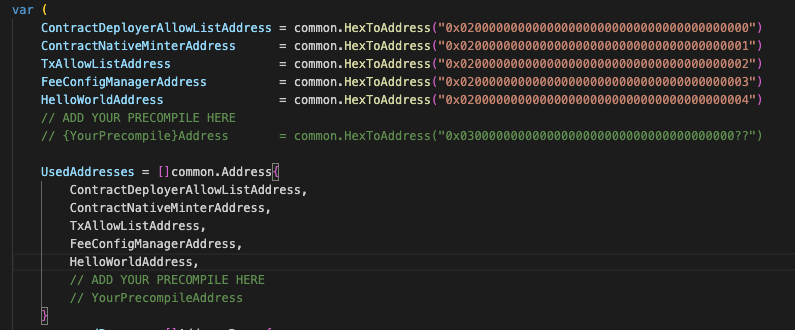
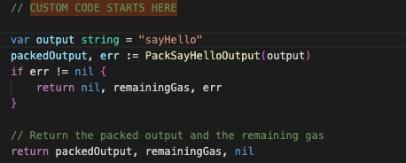

# Precompile Generation Tutorial

We can now generate a stateful precompile with the Precompile gen tool!

### Assumption of Knowledge
Before starting this tutorial it would be helpful if you had some context on the EVM, precompiles, and stateful precompiles. 
Here are some resources to get started put together. 

- [EVM Handbook](https://noxx3xxon.notion.site/noxx3xxon/The-EVM-Handbook-bb38e175cc404111a391907c4975426d)

- [Precompiles in Solidity](https://medium.com/@rbkhmrcr/precompiles-solidity-e5d29bd428c4)

- [Customizing the EVM with Stateful Precompiles](https://medium.com/avalancheavax/customizing-the-evm-with-stateful-precompiles-f44a34f39efd)

 
## Tutorial

Let's start by creating the Solidity interface that we want to implement. We can put this  in `./contract-examples/contracts`

```
// (c) 2022-2023, Ava Labs, Inc. All rights reserved.
// See the file LICENSE for licensing terms.

// SPDX-License-Identifier: MIT

pragma solidity >=0.8.0;

interface IHelloWorld {
  function sayHello() external returns (string calldata);

  // SetGreeting
  function setGreeting(string calldata recipient) external;
}
```

Now we have an interface that our precompile can implement!
Let's create an [abi](https://docs.soliditylang.org/en/v0.8.13/abi-spec.html#:~:text=Contract%20ABI%20Specification-,Basic%20Design,as%20described%20in%20this%20specification.) of our solidity code.

In the same `./contract-examples/contracts` directory, let's run

```
solcjs --abi IHelloWorld.sol
```

This spits out the abi code. Let's move it into a brand new folder in 
`./contract-examples/contracts/contract-abis`. 

IHelloWorld.abi

```
[{"inputs":[],"name":"sayHello","outputs":[{"internalType":"string","name":"","type":"string"}],"stateMutability":"nonpayable","type":"function"},{"inputs":[{"internalType":"string","name":"recipient","type":"string"}],"name":"setGreeting","outputs":[],"stateMutability":"nonpayable","type":"function"}]
```


## Some facts about the precompile tool

The precompile tool takes in 4 arguments. 
```
	abiFlag = &cli.StringFlag{
		Name:  "abi",
		Usage: "Path to the Ethereum contract ABI json to bind, - for STDIN",
	}
	typeFlag = &cli.StringFlag{
		Name:  "type",
		Usage: "Struct name for the precompile (default = ABI name)",
	}
	pkgFlag = &cli.StringFlag{
		Name:  "pkg",
		Usage: "Package name to generate the precompile into (default = precompile)",
	}
	outFlag = &cli.StringFlag{
		Name:  "out",
		Usage: "Output file for the generated precompile (default = STDOUT)",
	}
```

Currently it can only generate precompiles in Golang only.  


## Generating the precompile 

Now that we have an abi for the precompile gen tool to interact with. We can run the following command to generate our HelloWorld precompile!


In the root of the repo run 
```
go run ./cmd/precompilegen/main.go --abi ./contract-examples/contracts/contract-abis/IHelloWorld.abi --out ./precompile/hello_world.go
```

Wow! We just got a precompile template that's 80% complete located at `./precompile/hello_world.go`. Let's fill out the rest!

The precompile gives us commented instructions on the first 25 lines of the autogenerated file. 

```
// Code generated
// This file is a generated precompile contract with stubbed abstract functions.
// The file is generated by a template. Please inspect every code and comment in this file before use.

// There are some must-be-done changes waiting in the file. Each area requiring you to add your code is marked with CUSTOM CODE to make them easy to find and modify.
// Additionally there are other files you need to edit to activate your precompile.
// These areas are highlighted with comments "ADD YOUR PRECOMPILE HERE".
// For testing take a look at other precompile tests in core/stateful_precompile_test.go

/* General guidelines for precompile development:
1- Read the comment and set a suitable contract address in precompile/params.go. E.g:
	IHelloWorldAddress = common.HexToAddress("ASUITABLEHEXADDRESS")
2- Set gas costs here
3- It is recommended to only modify code in the highlighted areas marked with "CUSTOM CODE STARTS HERE". Modifying code outside of these areas should be done with caution and with a deep understanding of how these changes may impact the EVM.
Typically, custom codes are required in only those areas.
4- Add your upgradable config in params/precompile_config.go
5- Add your precompile upgrade in params/config.go
6- Add your solidity interface and test contract to contract-examples/contracts
7- Write solidity tests for your precompile in contract-examples/test
8- Create your genesis with your precompile enabled in tests/e2e/genesis/
9- Create e2e test for your solidity test in tests/e2e/solidity/suites.go
10- Run your e2e precompile Solidity tests with 'E2E=true ./scripts/run.sh'
```

## Step 1 

In `./precompile/params.go` let's set a precompile address. Let's call it  `HelloWorldAddress` 



Now when subnet evm sees the `HelloWorldAddress` as input when executing [`Call`](https://github.com/ava-labs/subnet-evm/blob/master/core/vm/evm.go#L222), it can [run the precompile](https://github.com/ava-labs/subnet-evm/blob/master/core/vm/evm.go#L271-L272)


## Step 2 
Set up gas costs. For now, I'll set some placeholder numbers since I'm not sure how much gas these functions will cost. 


Example: 
The sha256 precompile computes gas with the following equation
```
// This method does not require any overflow checking as the input size gas costs
// required for anything significant is so high it's impossible to pay for.
func (c *sha256hash) RequiredGas(input []byte) uint64 {
	return uint64(len(input)+31)/32*params.Sha256PerWordGas + params.Sha256BaseGas
}
```


We'll probably have to come back later and change these costs. 

## Step 3

Ok time to `CTRL F` throughout the file with `CUSTOM CODE STARTS HERE` to find the areas in the precompile that we need to modify. 


Ok looks like we can skip this step since our IHelloWorldConfig struct looks like this 
```
// IHelloWorldConfig implements the StatefulPrecompileConfig
// interface while adding in the IHelloWorld specific precompile address.
type IHelloWorldConfig struct {
	UpgradeableConfig
}
```

**Optional Note** 

If our IHelloWorldConfig wrapped another config in its struct  to implement the StatefulPrecompileConfig
like so 

```
// IHelloWorldConfig implements the StatefulPrecompileConfig
// interface while adding in the IHelloWorld specific precompile address.
type IHelloWorldConfig struct {
	UpgradeableConfig
    AllowListConfig
}
```

We would have modify the `Equal()` function as follows 


The next place we see the `CUSTOM CODE STARTS HERE` is in `Configure()`
Let's set it up. 


Next place to modify is in our `sayHello()` function.


Finally we can modify our `setGreeting()` function 


## Step 4 

Let's now modify `params/precompile_config.go`.

Let's add our key. 


Done! All we had to do was follow the comments.


## Step 5 

Let's add our precompile upgrade in `params/config.go`. 


## Step 6 
Add your solidity interface and test contract to `contract-examples/contracts`

We already have our interface in  `contract-examples/contracts`. 
Let's add our contract.

```
//SPDX-License-Identifier: MIT
pragma solidity ^0.8.0;

import "./IHelloWorld.sol";

// HelloWorld shows how the HelloWorld precompile can be used in a smart conract
contract HelloWorld {
  address constant HELLO_WORLD_ADDRESS = 0x0200000000000000000000000000000000000004;
  HelloWorld helloWorld = HelloWorld(HELLO_WORLD_ADDRESS);

  function sayHello() public returns (string memory) {
    return helloWorld.sayHello();
  }

  function setGreeting(string calldata greeting) public {
    helloWorld.setGreeting(greeting);
  }
}
```

## Step 7 
We can now write our hardhat test in `contract-examples/test`. I'm calling this file `TestHelloWorld.ts`

```
// (c) 2019-2022, Ava Labs, Inc. All rights reserved.
// See the file LICENSE for licensing terms.

import { expect } from "chai";
import { ethers } from "hardhat"
import {
    Contract,
    ContractFactory,
} from "ethers"

describe("HelloWorld", function () {
    let helloWorldContract: Contract;

    before(async function () {
        // Deploy Hello World Contract
        const ContractF: ContractFactory = await ethers.getContractFactory("HelloWorld");
        helloWorldContract = await ContractF.deploy();
        await helloWorldContract.deployed();
        const helloWorldContractAddress: string = helloWorldContract.address;
        console.log(`Contract deployed to: ${helloWorldContractAddress}`);
    });

    it("should sayHello properly", async function () {
        let result = await helloWorldContract.callStatic.sayHello();
        expect(result).to.equal("Hello World!");
    });

    it("should setGreeting and sayHello", async function () {
        const modifiedGreeting = "What's up";
        let tx = await helloWorldContract.setGreeting(modifiedGreeting);
        await tx.wait();

        expect(await helloWorldContract.callStatic.sayHello()).to.be.equal(modifiedGreeting);
    });
});
```

Cool now let's see if it passes. We need to get a local subnet-evm up and running. If we go to the `./scripts/run.sh` file, we can see a script that installs avalanchego, sets up a local network, and spins up a subnet-evm using the genesis. 

Before we run this script, we actually need to modify the genesis within `./scripts/run.sh` to enable our precompile. 


```
{
  "config": {
    "chainId": $CHAIN_ID,
    "homesteadBlock": 0,
    "eip150Block": 0,
    "eip150Hash": "0x2086799aeebeae135c246c65021c82b4e15a2c451340993aacfd2751886514f0",
    "eip155Block": 0,
    "eip158Block": 0,
    "byzantiumBlock": 0,
    "constantinopleBlock": 0,
    "petersburgBlock": 0,
    "istanbulBlock": 0,
    "muirGlacierBlock": 0,
    "subnetEVMTimestamp": 0,
    "feeConfig": {
      "gasLimit": 20000000,
      "minBaseFee": 1000000000,
      "targetGas": 100000000,
      "baseFeeChangeDenominator": 48,
      "minBlockGasCost": 0,
      "maxBlockGasCost": 10000000,
      "targetBlockRate": 2,
      "blockGasCostStep": 500000
    },
    "helloWorldConfig": {
      "blockTimestamp":0
    }
  },
  "alloc": {
    "${GENESIS_ADDRESS:2}": {
      "balance": "0x52B7D2DCC80CD2E4000000"
    }
  },
  "nonce": "0x0",
  "timestamp": "0x0",
  "extraData": "0x00",
  "gasLimit": "0x1312D00",
  "difficulty": "0x0",
  "mixHash": "0x0000000000000000000000000000000000000000000000000000000000000000",
  "coinbase": "0x0000000000000000000000000000000000000000",
  "number": "0x0",
  "gasUsed": "0x0",
  "parentHash": "0x0000000000000000000000000000000000000000000000000000000000000000"
}
```

Adding this to the config enables our precompile. 
```
  "helloWorldConfig": {
      "blockTimestamp":0
    }
```

As a reminder, we get the name `helloWorldConfig` by setting it in `./params/precompile_config.go`

```
// PrecompileUpgrade is a helper struct embedded in UpgradeConfig, representing
// each of the possible stateful precompile types that can be activated
// as a network upgrade.
type PrecompileUpgrade struct {
	ContractDeployerAllowListConfig *precompile.ContractDeployerAllowListConfig `json:"contractDeployerAllowListConfig,omitempty"` // Config for the contract deployer allow list precompile
	ContractNativeMinterConfig      *precompile.ContractNativeMinterConfig      `json:"contractNativeMinterConfig,omitempty"`      // Config for the native minter precompile
	TxAllowListConfig               *precompile.TxAllowListConfig               `json:"txAllowListConfig,omitempty"`               // Config for the tx allow list precompile
	FeeManagerConfig                *precompile.FeeConfigManagerConfig          `json:"feeManagerConfig,omitempty"`                // Config for the fee manager precompile
	IHelloWorldConfig               *precompile.IHelloWorldConfig               `json:"helloWorldConfig,omitempty"`
	// ADD YOUR PRECOMPILE HERE
	// {YourPrecompile}Config  *precompile.{YourPrecompile}Config `json:"{yourPrecompile}Config,omitempty"`
}
```

Here's the usage of the script: 
```./scripts/run.sh [AVALANCHEGO VERSION] [GENESIS_ADDRESS] ```

At the time of writing, the latest version of avalanchego is 1.7.18
so 

```./scripts/run.sh 1.7.18 0x8db97C7cEcE249c2b98bDC0226Cc4C2A57BF52FC```


Note that this address `0x8db97C7cEcE249c2b98bDC0226Cc4C2A57BF52FC` is a prefunded address on the local network, see here for more info. The private key for this address is `0x56289e99c94b6912bfc12adc093c9b51124f0dc54ac7a766b2bc5ccf558d8027`

If start up is successful then you should see something like this, 
```
MetaMask Quick Start:
Funded Address: 0x8db97C7cEcE249c2b98bDC0226Cc4C2A57BF52FC
Network Name: Local EVM
RPC URL: http://127.0.0.1:23518/ext/bc/2YtHHWeLCnwdqxExAQerayn2oMwZVdKbJUAQEom67eq36PWnax/rpc
Chain ID: 99999
Currency Symbol: LEVM
network-runner RPC server is running on PID 64362...

use the following command to terminate:

pkill -P 64362 && kill -2 64362 && pkill -9 -f srEXiWaHuhNyGwPUi444Tu47ZEDwxTWrbQiuD7FmgSAQ6X7Dy
```

Sweet! Now we have a rpc url that can be used to talk to the network!

We now need to modify the hardhat config located in `./contract-examples/contracts/hardhat.config.ts`

We need to modify the `local` network. 
Let's change `chainId`, `gas`, and `gasPrice`.

```
networks: {
    local: {
      //"http://{ip}:{port}/ext/bc/{chainID}/rpc
      // modify this in the local_rpc.json
      url: localRPC,
      chainId: 99999,
      accounts: [
        "0x56289e99c94b6912bfc12adc093c9b51124f0dc54ac7a766b2bc5ccf558d8027",
        "0x7b4198529994b0dc604278c99d153cfd069d594753d471171a1d102a10438e07",
        "0x15614556be13730e9e8d6eacc1603143e7b96987429df8726384c2ec4502ef6e",
        "0x31b571bf6894a248831ff937bb49f7754509fe93bbd2517c9c73c4144c0e97dc",
        "0x6934bef917e01692b789da754a0eae31a8536eb465e7bff752ea291dad88c675",
        "0xe700bdbdbc279b808b1ec45f8c2370e4616d3a02c336e68d85d4668e08f53cff",
        "0xbbc2865b76ba28016bc2255c7504d000e046ae01934b04c694592a6276988630",
        "0xcdbfd34f687ced8c6968854f8a99ae47712c4f4183b78dcc4a903d1bfe8cbf60",
        "0x86f78c5416151fe3546dece84fda4b4b1e36089f2dbc48496faf3a950f16157c",
        "0x750839e9dbbd2a0910efe40f50b2f3b2f2f59f5580bb4b83bd8c1201cf9a010a"
      ],
      gasPrice: 25000000000,
      gas: 10000000,
    },
```

We also need to make sure `localRPC` points to the right value.

Let's copy `local_rpc.example.json`. 

``` cp local_rpc.example.json local_rpc.json ``` 

Now in `local_rpc.json` we can modify the rpc url to the one we just created. It should look something like this. 

```
{
  "rpc": "http://127.0.0.1:23518/ext/bc/2YtHHWeLCnwdqxExAQerayn2oMwZVdKbJUAQEom67eq36PWnax/rpc"
}
```

Now if we go to `./contract-examples`, we can finally run our tests. 

``` npx hardhat test --network local ```

Great they passed! All the functions we implemented in the precompile work as expected!

## Step 8 

Now we can create our own genesis. Since we modified the genesis in the `run.sh` script, we can use that!
In `tests/e2e/genesis/`, let's create our own genesis file,  `hello_world.json`. This should be pretty similar to the genesis we editted previously. 

```
{
    "config": {
        "chainId": 99999,
        "homesteadBlock": 0,
        "eip150Block": 0,
        "eip150Hash": "0x2086799aeebeae135c246c65021c82b4e15a2c451340993aacfd2751886514f0",
        "eip155Block": 0,
        "eip158Block": 0,
        "byzantiumBlock": 0,
        "constantinopleBlock": 0,
        "petersburgBlock": 0,
        "istanbulBlock": 0,
        "muirGlacierBlock": 0,
        "subnetEVMTimestamp": 0,
        "feeConfig": {
            "gasLimit": 20000000,
            "minBaseFee": 1000000000,
            "targetGas": 100000000,
            "baseFeeChangeDenominator": 48,
            "minBlockGasCost": 0,
            "maxBlockGasCost": 10000000,
            "targetBlockRate": 2,
            "blockGasCostStep": 500000
        },
        "helloWorldConfig": {
            "blockTimestamp": 0,
            "adminAddresses": [
                "0x8db97C7cEcE249c2b98bDC0226Cc4C2A57BF52FC"
            ]
        }
    },
    "alloc": {
        "8db97C7cEcE249c2b98bDC0226Cc4C2A57BF52FC": {
            "balance": "0x52B7D2DCC80CD2E4000000"
        },
        "0x0Fa8EA536Be85F32724D57A37758761B86416123": {
            "balance": "0x52B7D2DCC80CD2E4000000"
        }
    },
    "nonce": "0x0",
    "timestamp": "0x0",
    "extraData": "0x00",
    "gasLimit": "0x1312D00",
    "difficulty": "0x0",
    "mixHash": "0x0000000000000000000000000000000000000000000000000000000000000000",
    "coinbase": "0x0000000000000000000000000000000000000000",
    "number": "0x0",
    "gasUsed": "0x0",
    "parentHash": "0x0000000000000000000000000000000000000000000000000000000000000000"
}
```


## Step 9 


